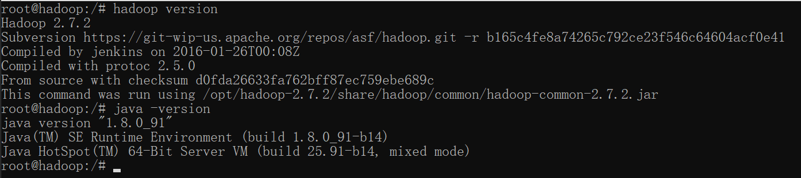
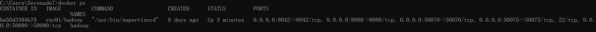
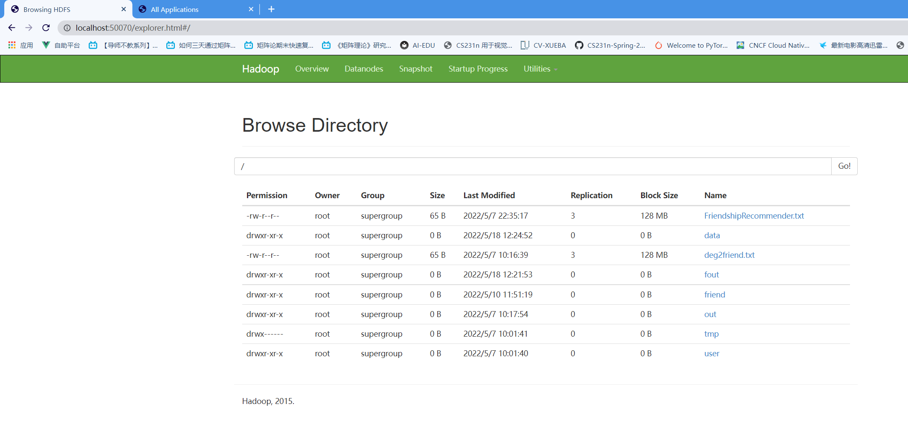
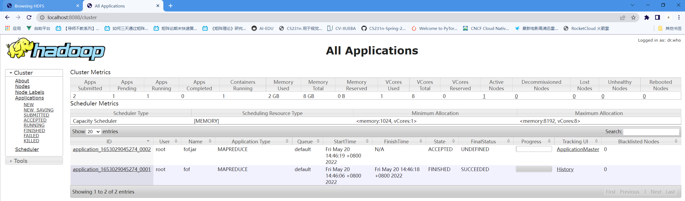
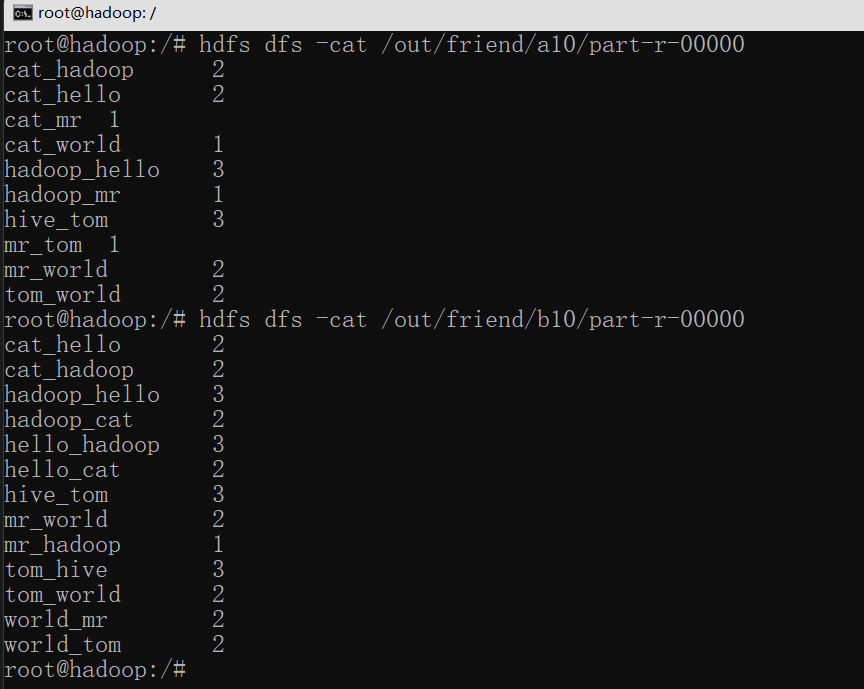

# MapReduce编程模型实现好友推荐

**NCEPU Big Data Course**

---

## 好友推荐原理

假设有数据集

```text
tom hello hadoop cat
world hadoop hello hive
cat tom hive
mr hive hello.
```

A BCDEF


1、找到A到BCDEF的共同好友数。

2、按照共同好友数对BCDEF进行排序。

### **第一次map**


**输入数据：**
```text
tom hello hadoop cat
world hadoop hello hive
cat tom hive
mr hive hello
```
**要输出数据如下数据**

以tom hello hadoop cat该条数据为例

**R 代表认识**
```
tom_hello  R
tom_hadoop  R
tom_cat  R
```

**G 代表有共同好友**
```
hello_hadoop G
hello_cat   G
hadoop_cat  G
```


> 将全部文件遍历处理完毕，然后将所有的hello_hadoop的关系以及hadoop_helo的关系全部找出来，看一共多少个键值对，也就是共同好友数。

map输出格式如下：
```
<"tom_hello","R">
<"hello_cat","G">
```

**第一次reduce**

去除关系"R",统计关系"G"。

reduce输出格式如下
```
<"hadoop_hello", 3>   //hadoop与hello 之间有3个共同好友
```


**第二次map**
```
<"hadoop_hello", 3>
输入hadoop_hello  3  其中有个分割符号转义字符\t
key:cat_hadoop  value:2
```

因为hadoop hello 3 可以给hadoop推荐hello，共同好友3。可以给hello推荐hadoop，共同好友3。

通过Mykey实现WritableComparable接口，对Mykey进行比较，实现compareTo()、writ()、readFields()三个方法，需要按照共同好友数倒序排列。

map输出：
```
<obj,"hadoop_hello\t3">
<obj,"hello_hadoop\t3">
```

这时候表示从hadoop看与hello的关系有3个共同好友,即从hadoop看谁的共同好友数多即有可能认识，从而推荐。

这时候表示从hello看与hadoop的关系有3个共同好友,即从hello看谁的共同好友数多即有可能认识，从而推荐。

**此时MyGroupingComparator和MyPartitioner分别重写compare()方法和getPartition()方法实现分组和分区。**

**第二次reduce**
```
输入:
<obj,"hadoop_hello\t3">
<obj,"hello_hadoop\t3">   //  \t表示转义字符
```
对所有value进行循环倒序输出要推荐的好友。

---


## 实验环境 

* Win11 
* Docker
  * [ruo91/hadoop:lastest](https://hub.docker.com/search?q=%20ruo91%2Fhadoop)
  * hadoop-2.7.2
  * jdk 1.8




数据集fof.txt
```txt
tom hello hadoop cat
world hadoop hello hive
cat tom hive
mr hive hello.
hive cat hadoop world hello mr
hadoop tom hive world
hello tom world hive mr
```
### MapRedece编码规范
1. Mapper阶段
* 用户自定义的Mapper要继承自己的父类
* Mapper的输入数据是KV对的形式（KV的类型可自定义）
* Mapper中的业务逻辑写在map()方法中
* Mapper的输出数据是KV对的形式（KV的类型可自定义）
* map()方法（MapTask进程）对每一个调用一次


2. Reducer阶段
* 用户自定义的Reducer要继承自己的父类
* Reducer的输入数据类型对应Mapper的输出数据类型，也是KV
* Reducer的业务逻辑写在reduce()方法中
* ReduceTask进程对每一组相同k的组调用一次reduce()方法


3. Driver阶段
* 相当于YARN集群的客户端，用于提交我们整个程序到YARN集群，提交的是封装了MapReduce程序相关运行参数的job对象

### configuration类简介
Hadoop没有使用java.util.Properties管理配置文件，也没有使用Apache Jakarta Commons Configuration管理配置文件，而是使用了一套独有的配置文件管理系统，并提供自己的API，即用org.apache.hadoop.conf.Configuration处理配置信息。这个类是作业的配置信息类，任何作用的配置信息必须通过Configuration传递，因为通过Configuration可以实现在多个mapper和多个reducer任务之间共享信息


### 实验过程

拉取镜像
```
docker pull ruo91/hadoop
```

运行ruo91/hadoop容器
```
docker run -d --name="hadoop" -h "hadoop" -p 8042:8042 -p 8088:8088 -p 50070:50070 -p 50075:50075 -p 50090:50090 ruo91/hadoop /etc/bootstrap.sh -bash
```


50070：HDFS文件管理页面

9000：是fileSystem默认的端口号 浏览器直接访问是访问不到的

8088：运行mapreduce作业，其的运行状态会在8088显示

浏览器输入localhost:50070  or localhost:8088可以进入相应的web界面。







jps
查看hadoop服务是否正常开启。否，执行命令
>$ start-all.sh


**win11下会存在的错误**
使用Docker Desktop启动一个镜像以后，发现直接 EXITED(139)这时候用 docker log containerId 也获取不到任何日志

我找到的资料目前主要是libc的版本低于2.14会导致出现 exit 139 的这样一个问题，可能与Linux内核相关

解决方法：
```
创建C:\Users\(用户名)\.wslconfig，里面写入
[wsl2]
kernelCommandLine = vsyscall=emulate
```

导入数据集到hadoop容器内。
```
docker cp fof.txt 容器id:/
```

进入hadoop容器
```
docker exec -it 容器id "bash"
```

将fof.txt数据上传到hdfs中。

HDFS上传文件：
```
hdfs dfs -put text.txt /test
```

可能有用的命令：
> * HDFS创建文件夹：hdfs dfs -mkdir -p /test
> * 查看文件目录：hdfs dfs -ls
> * 删除文件：hdfs dfs -rm  /text.txt
> * 查看文件内容 hdfs dfs -cat 


### code
准备好数据集与环境后，编写完代码通过生成jar包文件，将jar导入hadoop容器中。

导入fof.jar到hadoop容器内：
> docker cp fof.jar 容器id:/

执行程序:
```
$ hadoop jar fof.jar fof.MainClass /data/fof/input/fof.txt /out/friend/a10 /out/friend/b10
```
命令行参数解释：
* fof.jar 为生成导入的jar包
* fof.MainClass 如无，则会报错java.lang.ClassNotFoundException，好像是为程序入口？通过官网查找命令解决。
* /data/fof/input/fof.txt 从hdfs读取的输入文件
* /out/friend/a11  第一次map reduce后的输出，也是第二次map reduce的输入
* /out/friend/b11  第二次map reduce后的输出。

执行成功后查看输出结果



**可能存在问题的解决：**

1. org.apache.hadoop.dfs.SafeModeException: Cannot delete/user/hadoop/input. Name node is in safe mode.

    在安全模式下输入指令：
    > hadoop dfsadmin -safemode leave
2. windows下Hadoop在浏览器中Browse Directory，无法下载文件的问题

    docker网络问题，因为没有指定docker网络，所以网络都默认分配到docker0上。而使用ifconfig命令也是只能得到docker0下的容器网络地址(即docker0的内网地址)。宿主机要通过映射docker0的网段进行访问(相当于路由器)。
    > 修改windows下的hosts文件，将容器名称映射为docker0的地址，因为download会访问 容器名:50075的地址，此操作是通过docker0的50075端口转发到容器内。部署集群的话还是用自定义网络(brige)好。
